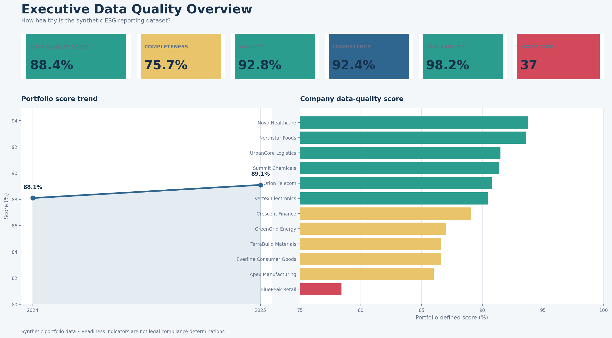
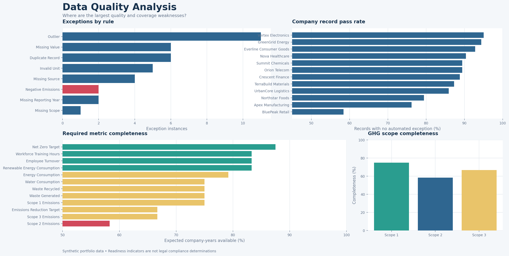
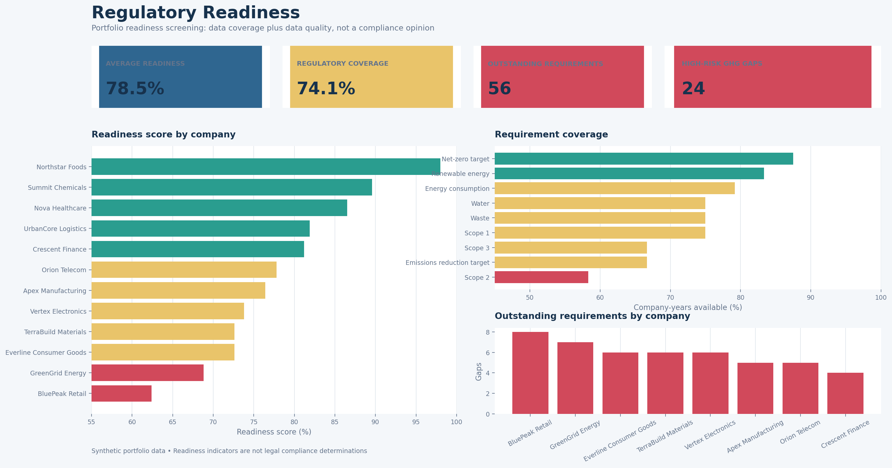
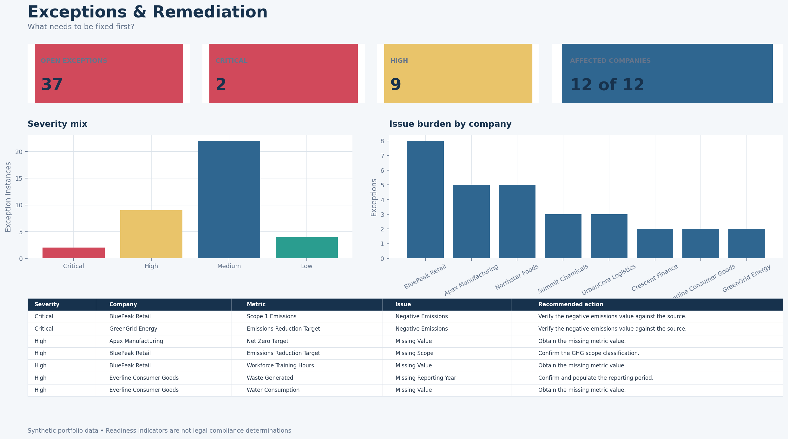

# ESG Data Quality & Regulatory Readiness

An end-to-end portfolio project that demonstrates how an analyst can turn raw ESG records into controlled, explainable data-quality metrics, a remediation queue, and a Tableau decision-support layer.

> **Data and compliance disclaimer:** all company records are synthetic. The readiness model is a portfolio-designed control framework, not a legal opinion, certification, or claim of regulatory compliance.



## Business problem

Sustainability reporting teams need to know whether ESG data is complete, valid, internally consistent, and traceable before it is used in management or external reporting. Raw values alone do not answer three practical questions:

1. How healthy is the reporting dataset?
2. Where are the most material data gaps and control failures?
3. What should the team remediate first?

This project implements a repeatable control layer that answers those questions without overstating regulatory conclusions.

## Project objective

Create a reproducible ESG data-quality pipeline and business-facing BI workbook that:

- validates source records with deterministic rules;
- distinguishes record pass rate from a weighted quality score;
- measures expected metric coverage at company-year level;
- flags exceptions with severity and recommended action;
- screens reporting readiness by requirement, entity, and year;
- packages the results into four coherent Tableau dashboards.

## Dataset

- **223** synthetic ESG source records
- **12** synthetic companies
- **2024–2025** reporting periods, plus two deliberately missing-year records
- **12** expected metrics spanning climate, energy, water, waste, and workforce topics
- controlled metric/unit reference and validation-rule tables

The dataset intentionally contains missing values, duplicates, invalid units, negative emissions, missing scope/year/source references, and statistical outliers so that the validation workflow can be demonstrated.

## Architecture

```text
Raw synthetic ESG data
        ↓
Metric and unit reference join
        ↓
Deterministic validation + IQR outlier screening
        ↓
Validated records + exception log
        ↓
Company-year completeness and quality scores
        ↓
Portfolio readiness screening
        ↓
Tableau-ready CSVs → four-dashboard workbook
```

## Data-quality framework

The portfolio-defined score is:

```text
30% Completeness + 30% Validity + 25% Consistency + 15% Traceability
```

- **Completeness:** required company-year-metric combinations available.
- **Validity:** records without missing values, invalid units, negative emissions, missing reporting years, or missing emissions scopes.
- **Consistency:** records without duplicate business keys or IQR outlier flags.
- **Traceability:** records with a source reference.
- **Record pass rate:** share of records with no automated exception of any type. This is reported separately from the weighted score.

Outliers use the 1.5×IQR rule within each metric. They are review signals, not automatic proof that a reported value is wrong.

## Regulatory-readiness methodology

Readiness is assessed for nine selected data areas at company-year level: Scope 1, Scope 2, Scope 3, energy consumption, renewable energy, emissions reduction target, net-zero target, water, and waste.

```text
Readiness Score = 70% requirement coverage + 30% data-quality score
```

Missing Scope 1/2/3 requirements receive the highest prioritization because they represent core GHG data gaps in this simplified model. The calculation is a management-readiness indicator only; it does not implement CSRD, CDP, or GHG Protocol requirements in full.

## Tableau dashboards

The packaged workbook is [`tableau/ESG_Data_Quality_Regulatory_Readiness.twbx`](tableau/ESG_Data_Quality_Regulatory_Readiness.twbx). A readable `.twb` source version and packaged CSV sources are also included.

### 1. Executive Data Quality Overview

Answers **“How healthy is our ESG data?”** with the weighted score, completeness, validity, consistency, traceability, records assessed, exception counts, year trend, and company ranking.

### 2. Data Quality Analysis

Answers **“Where are the biggest weaknesses?”** with company quality rankings, exception types, required-metric coverage, and focused Scope 1/2/3 completeness.



### 3. Regulatory Readiness

Answers **“Which entities and reporting requirements have the largest preparation gaps?”** with readiness score, requirement status, outstanding requirements, and high-risk GHG gaps.



### 4. Exceptions & Remediation

Answers **“What needs to be fixed first?”** with open exceptions, critical/high issue volume, severity by company, exception-type breakdown, and a prioritized entity view.



## Key KPIs and findings

| KPI | Result |
|---|---:|
| Weighted data-quality score | 88.4% |
| Record pass rate | 84.3% |
| Completeness | 75.7% |
| Validity | 92.8% |
| Consistency | 92.4% |
| Traceability | 98.2% |
| Exception instances | 37 |
| High + critical exceptions | 11 |

Key analytical findings:

- Scope 2 is the least complete required metric at **58.3%** of expected company-years.
- Outliers are the most frequent exception type with **11** instances; these require evidence review rather than automatic correction.
- BluePeak Retail has the lowest weighted quality score (**78.4%**) and lowest readiness score (**62.4%**), making it the first remediation candidate in this synthetic portfolio.
- The weighted quality score improved from **88.1% in 2024 to 89.1% in 2025**, while completeness declined from **76.4% to 75.0%**. The improvement therefore reflects stronger record-level controls, not broader coverage.

## Technology stack

- Python 3 and pandas
- deterministic validation and 1.5×IQR screening
- CSV analytical marts
- Excel companion workbook
- Tableau workbook XML and packaged `.twbx`
- automated tests and structural workbook validation

## Project structure

```text
data/       Raw, reference, validated, and Tableau-ready CSVs
docs/       Methodology, rules, framework context, and dashboard previews
excel/      Companion Excel data-quality engine
python/     Pipeline, tests, Tableau build, and preview scripts
tableau/    Tableau workbook source, package, and packaged data
```

## Reproduce the project

From the repository root:

```bash
python python/esg_data_quality_engine.py
python python/test_validation_engine.py
python python/build_tableau_workbook.py
python python/create_dashboard_previews.py
```

Open `tableau/ESG_Data_Quality_Regulatory_Readiness.twbx` in Tableau Desktop or Tableau Public. The packaged workbook contains the required CSV sources; the loose `.twb` expects the `tableau/Data` folder beside it.

## Assumptions and limitations

- All companies and records are synthetic.
- The rules are deliberately simplified for portfolio demonstration.
- The readiness score is not an external standard and does not determine legal compliance.
- IQR flags can identify valid extreme values; remediation requires source evidence.
- Source freshness dates and workflow timestamps are not present, so a timeliness score and exception-aging metric are not fabricated.
- Two records have missing reporting years; they are included in overall controls but excluded from year-specific views until remediated.
- The static dashboard images are source-backed previews. Final fonts, spacing, and filters should be visually confirmed in the target Tableau version after opening the packaged workbook.

